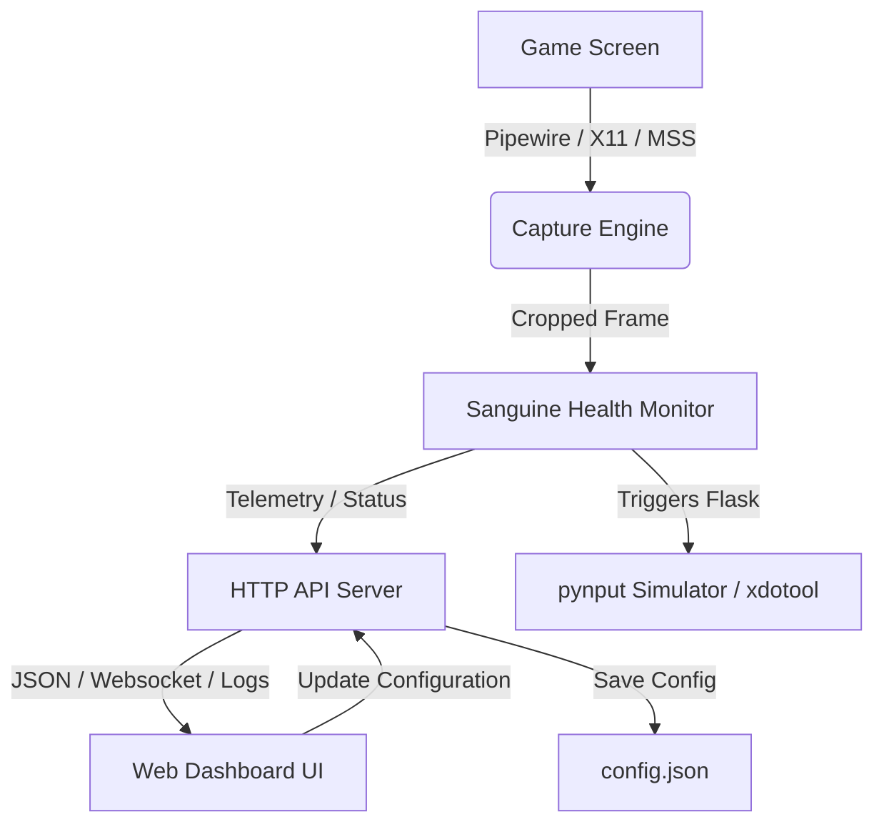

# Sanguine Sentry 🍷🛡️

Sanguine Sentry is an advanced auto-flask calibration and health-globe monitoring utility for action RPGs on Linux and Windows.

> **Do not use it in Path of Exile or any other online game whose terms forbid input automation.** It reads the screen and presses keys on its own, which Path of Exile's terms of use prohibit (one server action per keypress) and can get an account banned. It is intended for offline or single-player games and for testing.

It features a robust Python monitoring service, a high-performance Wayland/Pipewire screen capture daemon written in Rust, and a responsive web dashboard for real-time calibration, visual targeting, and telemetry.

---

## Key Features

- **🎯 Real-Time Visual Sensor & Cropping**: Use the dashboard to select and crop your health globe down to a precise visual target.
- **⚡ Dual Capture Engine**:
  - **Linux Wayland**: PipeWire capture through [portalgrab](https://github.com/dcastro86/portalgrab) for high-frame-rate, hardware-accelerated screenshots.
  - **Linux X11 & Windows**: Fast native cross-platform fallback captures.
- **🧠 Flexible Analysis Logic**:
  - **Percent Mode**: Computes the ratio of red pixels to background pixels in a column crop to determine your current health percentage.
  - **OpenCV Template Matching**: Matches image shapes/globe structures for games with dynamic or shifting health globes.
- **🛡️ Fail-Safe Town/Loading Gate**: Define a pixel color gate (e.g., checking UI elements that only appear in combat zones) to automatically suspend flask activation in town or during loading screens.
- **🎛️ Dynamic Hotkeys & Custom Actions**: Bind triggers to simulated key/mouse inputs (using `pynput`) or run custom OS commands (like `xdotool`).
- **📊 Interactive Web Dashboard**: Live telemetry graph, screenshot crop previews, mouse position trackers, configuration editors, and real-time logs.
- **🔒 API Authentication & Rebinder Shield**: Secured HTTP API with random startup authentication tokens and strict `Host` header verification to prevent DNS rebinding.
- **🚀 NumPy-Vectorized Scans**: Health globe calculations are fully vectorized using NumPy, dropping scan overhead from ~5ms to `<0.1ms` per frame.
- **💎 Dynamic Frame Optimization**: Rust capture daemon runs at zero CPU/GPU overhead when no dashboard client is connected, using active connection counting.
- **🔔 Toast Notifications & Polling Backoff**: Vanilla CSS non-blocking toast notifications and exponential polling backoff when the API server is offline.

---

## Architecture

The system is structured as follows:



- **Backend (`monitor.py`, `server.py`)**: Runs a multithreaded Python service containing the monitoring daemon, the keyboard/mouse event listener, and a lightweight web server (on port `8080`).
- **Wayland capture ([portalgrab](https://github.com/dcastro86/portalgrab))**: A separate daemon that holds an `xdg-desktop-portal` screen cast open and serves screen regions over a Unix socket, which gets around screenshot limits on Wayland.
- **Frontend Dashboard (`web/`)**: Vanilla HTML5, CSS, and JS dashboard using pure CSS styling, SVG icons, and standard Web APIs.

---

## Installation & Setup

### Prerequisites
- **Python 3.10+** (with `pip` and virtual environment support)
- **[portalgrab](https://github.com/dcastro86/portalgrab)** (Wayland only)
- System libraries: OpenCV dependencies, `xdotool` (optional, for custom commands)

### 1. Clone & Set Up Virtual Environment
```bash
git clone https://github.com/dcastro86/sanguine-sentry.git
cd sanguine-sentry
python -m venv .venv
source .venv/bin/activate
pip install -r requirements.txt
```

### 2. (Wayland only) Install portalgrab
Under Wayland, fast capture comes from [portalgrab](https://github.com/dcastro86/portalgrab). Install it and enable its user service by following its README. Sanguine Sentry uses it automatically whenever `$XDG_RUNTIME_DIR/portalgrab.sock` exists; otherwise it falls back to `spectacle` screenshots.

### 3. Run the Server
```bash
python api/server.py
```
This starts the monitoring engine and spins up the web dashboard on [http://localhost:8080](http://localhost:8080).

---

## Configuration

Sanguine Sentry reads and writes to `config.json` at runtime. Below are the key configuration options:

| Property | Type | Description |
|---|---|---|
| `enabled` | `bool` | Enables or disables flask auto-triggering. |
| `check_interval` | `float` | Loop delay in seconds (e.g., `0.05` for checking 20 times per second). |
| `cooldown` | `float` | Cool-down time in seconds after triggering before a flask can be activated again. |
| `monitor_x`, `monitor_y` | `int` | Coordinates of the target pixel/region representing the health threshold. |
| `trigger_key` | `string` | The hotkey to press when the trigger fires (e.g., `1`, `mouse5`). |
| `gate_enabled` | `bool` | Enables the safety gate checking. |
| `gate_x`, `gate_y` | `int` | Screen coordinates to check for the combat-safety gate. |
| `gate_r`, `gate_g`, `gate_b` | `int` | Expected RGB color at the gate coordinates. |
| `bind_ip` | `string` | The IP address the HTTP server binds to (default: `127.0.0.1` for local safety. Set to `0.0.0.0` to allow local network connections). |
| `port` | `int` | The HTTP server port (default: `8080`). |

---

## Telemetry & Dashboard Preview

The web dashboard provides:
1. **Live Crop Feed**: Visually verify where the screenshot cropping is reading.
2. **RGB & Ratio Trend Graphs**: Inspect color ratios over time.
3. **Visual Calibration Tool**: Click on the crop preview to adjust alignment coordinates instantly.
4. **Log Panel**: View real-time activation logs, capture FPS, and debug notices.

---

## Security & Sandbox

To ensure local safe execution, Sanguine Sentry implements the following protections:
1. **API Token Validation:** A cryptographically secure random API token is generated the first time the server starts without one, and saved in `config.json` (gitignored, `0600`) for later starts. Every front-end API request must authenticate with an `X-API-Token` header.
2. **DNS Rebinding Shield:** Strict validation of the HTTP `Host` header to reject unauthorized external requests.
3. **Execution Splitting:** Employs argument-list execution via `shlex` and drops shell invocations (`shell=False`) for command triggers.
4. **Local Socket Hardening:** The Wayland capture socket belongs to portalgrab. It lives in `$XDG_RUNTIME_DIR` with `0600` permissions and accepts only clients running as the same user.

---

## License

This project is open-source and available under the MIT License.
