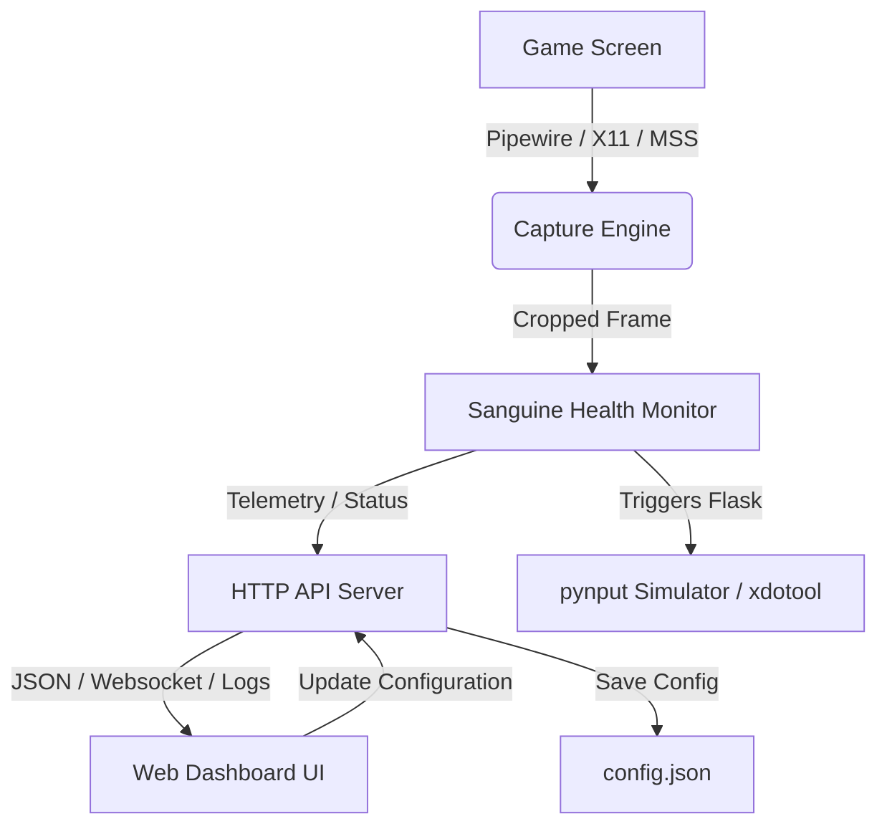

# Sanguine Sentry 🍷🛡️

Sanguine Sentry is an advanced auto-flask calibration and health-globe monitoring utility designed primarily for action RPGs (such as *Path of Exile*) on Linux and Windows. It features a robust Python monitoring service, a high-performance Wayland/Pipewire screen capture daemon written in Rust, and a responsive web dashboard for real-time calibration, visual targeting, and telemetry.

---

## Key Features

- **🎯 Real-Time Visual Sensor & Cropping**: Use the dashboard to select and crop your health globe down to a precise visual target.
- **⚡ Dual Capture Engine**:
  - **Linux Wayland**: Rust-based Pipewire/zbus capture (`sanguine_wayland_capture`) for high-frame-rate, hardware-accelerated screenshots.
  - **Linux X11 & Windows**: Fast native cross-platform fallback captures.
- **🧠 Flexible Analysis Logic**:
  - **Percent Mode**: Computes the ratio of red pixels to background pixels in a column crop to determine your current health percentage.
  - **OpenCV Template Matching**: Matches image shapes/globe structures for games with dynamic or shifting health globes.
- **🛡️ Fail-Safe Town/Loading Gate**: Define a pixel color gate (e.g., checking UI elements that only appear in combat zones) to automatically suspend flask activation in town or during loading screens.
- **🎛️ Dynamic Hotkeys & Custom Actions**: Bind triggers to simulated key/mouse inputs (using `pynput`) or run custom OS commands (like `xdotool`).
- **📊 Interactive Web Dashboard**: Live telemetry graph, screenshot crop previews, mouse position trackers, configuration editors, and real-time logs.

---

## Architecture

The system is structured as follows:



- **Backend (`monitor.py`, `server.py`)**: Runs a multithreaded Python service containing the monitoring daemon, the keyboard/mouse event listener, and a lightweight web server (on port `8080`).
- **Rust Sub-project (`sanguine_wayland_capture/`)**: Compiles into a native binary that interfaces directly with Pipewire streams via D-Bus portals (`xdg-desktop-portal`), resolving screenshot limitations on modern Linux distributions utilizing Wayland.
- **Frontend Dashboard (`web/`)**: Vanilla HTML5, CSS, and JS dashboard using pure CSS styling, SVG icons, and standard Web APIs.

---

## Installation & Setup

### Prerequisites
- **Python 3.10+** (with `pip` and virtual environment support)
- **Rust Toolchain** (if compiling the Wayland capture agent)
- System libraries: OpenCV dependencies, `xdotool` (optional, for custom commands)

### 1. Clone & Set Up Virtual Environment
```bash
git clone https://github.com/dcastro86/sanguine-sentry.git
cd sanguine-sentry
python -m venv .venv
source .venv/bin/activate
pip install -r requirements.txt
```

### 2. (Optional) Compile Wayland Capture Daemon
If you are running on Linux under a Wayland session:
```bash
cd sanguine_wayland_capture
cargo build --release
cd ..
```
The python backend will automatically attempt to spawn and establish socket communication with this binary if a Wayland session is detected.

### 3. Run the Server
```bash
python server.py
```
This starts the monitoring engine and spins up the web dashboard on [http://localhost:8080](http://localhost:8080).

---

## Configuration

Sanguine Sentry reads and writes to `config.json` at runtime. Below are the key configuration options:

| Property | Type | Description |
|---|---|---|
| `enabled` | `bool` | Enables or disables flask auto-triggering. |
| `check_interval` | `float` | Loop delay in seconds (e.g., `0.05` for checking 20 times per second). |
| `cooldown` | `float` | Cool-down time in seconds after triggering before a flask can be activated again. |
| `monitor_x`, `monitor_y` | `int` | Coordinates of the target pixel/region representing the health threshold. |
| `trigger_key` | `string` | The hotkey to press when the trigger fires (e.g., `1`, `mouse5`). |
| `gate_enabled` | `bool` | Enables the safety gate checking. |
| `gate_x`, `gate_y` | `int` | Screen coordinates to check for the combat-safety gate. |
| `gate_r`, `gate_g`, `gate_b` | `int` | Expected RGB color at the gate coordinates. |

---

## Telemetry & Dashboard Preview

The web dashboard provides:
1. **Live Crop Feed**: Visually verify where the screenshot cropping is reading.
2. **RGB & Ratio Trend Graphs**: Inspect color ratios over time.
3. **Visual Calibration Tool**: Click on the crop preview to adjust alignment coordinates instantly.
4. **Log Panel**: View real-time activation logs, capture FPS, and debug notices.

---

## License

This project is open-source and available under the MIT License.
